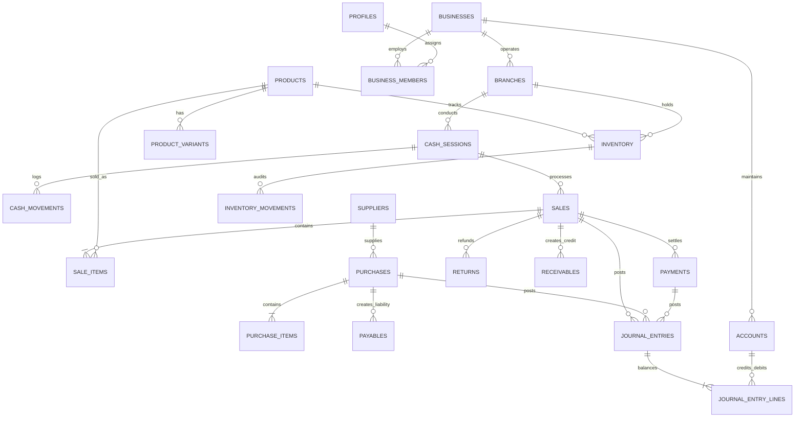
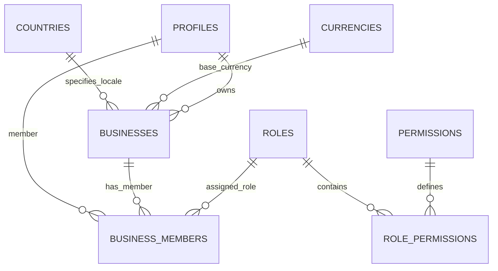
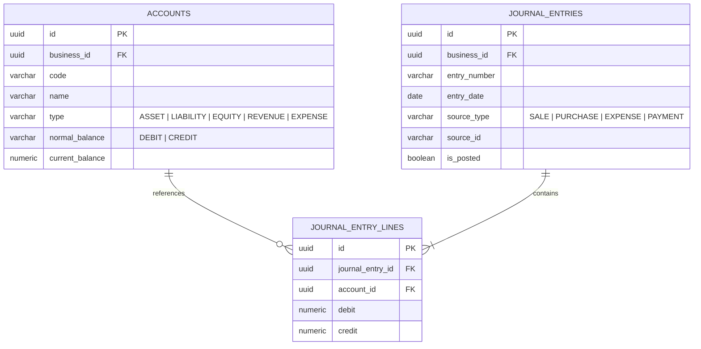

# PADUPOS — Entity Relationship Diagrams (ERD)

## 1. Core Operating Loop ERD

```mermaid
erDiagram
    BUSINESSES ||--o{ BRANCHES : operates
    BUSINESSES ||--o{ BUSINESS_MEMBERS : employs
    PROFILES ||--o{ BUSINESS_MEMBERS : assigns
    
    BRANCHES ||--o{ CASH_SESSIONS : conducts
    CASH_SESSIONS ||--o{ CASH_MOVEMENTS : logs
    CASH_SESSIONS ||--o{ SALES : processes
    
    PRODUCTS ||--o{ PRODUCT_VARIANTS : has
    PRODUCTS ||--o{ INVENTORY : tracks
    BRANCHES ||--o{ INVENTORY : holds
    INVENTORY ||--o{ INVENTORY_MOVEMENTS : audits
    
    SALES ||--|{ SALE_ITEMS : contains
    PRODUCTS ||--o{ SALE_ITEMS : sold_as
    SALES ||--o{ PAYMENTS : settles
    SALES ||--o{ RETURNS : refunds
    SALES ||--o{ RECEIVABLES : creates_credit
    
    SUPPLIERS ||--o{ PURCHASES : supplies
    PURCHASES ||--|{ PURCHASE_ITEMS : contains
    PURCHASES ||--o{ PAYABLES : creates_liability
    
    BUSINESSES ||--o{ ACCOUNTS : maintains
    SALES ||--o{ JOURNAL_ENTRIES : posts
    PURCHASES ||--o{ JOURNAL_ENTRIES : posts
    PAYMENTS ||--o{ JOURNAL_ENTRIES : posts
    JOURNAL_ENTRIES ||--|{ JOURNAL_ENTRY_LINES : balances
    ACCOUNTS ||--o{ JOURNAL_ENTRY_LINES : credits_debits
```

---

## 2. Multi-Tenant Tenancy & Membership Model

```mermaid
erDiagram
    COUNTRIES ||--o{ BUSINESSES : specifies_locale
    CURRENCIES ||--o{ BUSINESSES : base_currency
    PROFILES ||--o{ BUSINESSES : owns
    PROFILES ||--o{ BUSINESS_MEMBERS : member
    BUSINESSES ||--o{ BUSINESS_MEMBERS : has_member
    ROLES ||--o{ BUSINESS_MEMBERS : assigned_role
    ROLES ||--o{ ROLE_PERMISSIONS : contains
    PERMISSIONS ||--o{ ROLE_PERMISSIONS : defines
```

---

## 3. Double-Entry Accounting Model

```mermaid
erDiagram
    ACCOUNTS {
        uuid id PK
        uuid business_id FK
        varchar code
        varchar name
        varchar type "ASSET | LIABILITY | EQUITY | REVENUE | EXPENSE"
        varchar normal_balance "DEBIT | CREDIT"
        numeric current_balance
    }
    
    JOURNAL_ENTRIES {
        uuid id PK
        uuid business_id FK
        varchar entry_number
        date entry_date
        varchar source_type "SALE | PURCHASE | EXPENSE | PAYMENT"
        varchar source_id
        boolean is_posted
    }
    
    JOURNAL_ENTRY_LINES {
        uuid id PK
        uuid journal_entry_id FK
        uuid account_id FK
        numeric debit
        numeric credit
    }

    ACCOUNTS ||--o{ JOURNAL_ENTRY_LINES : references
    JOURNAL_ENTRIES ||--|{ JOURNAL_ENTRY_LINES : contains
```
